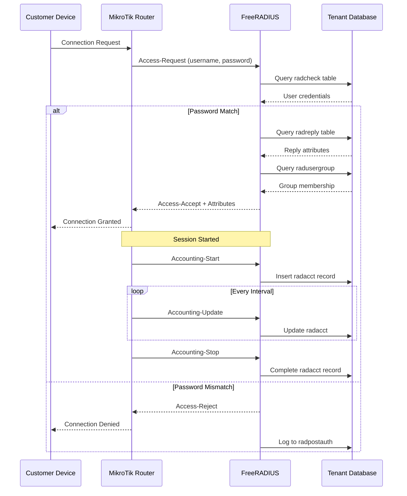
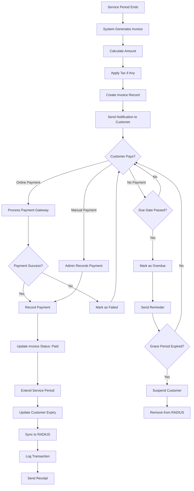
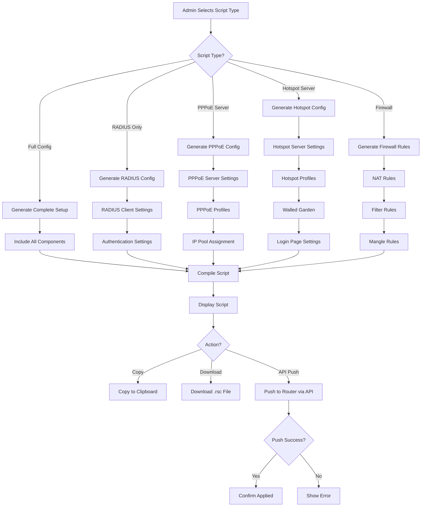
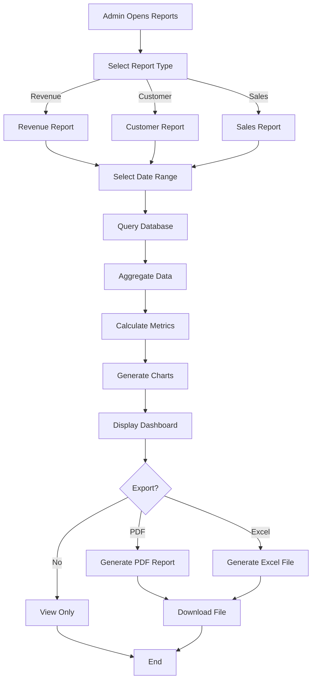
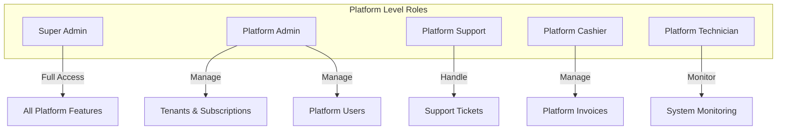
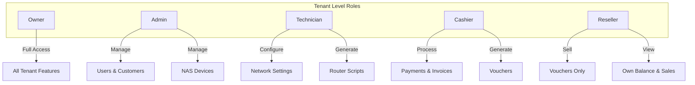

# ISP Manager - Multi-Tenant SaaS Platform

<p align="center">
  
  
  
  
</p>

<p align="center">
  Platform manajemen ISP berbasis cloud yang komprehensif untuk mengelola router MikroTik, pelanggan Hotspot/PPPoE, voucher, dan billing dalam arsitektur multi-tenant.
</p>

---

## Daftar Isi

- [Tentang Proyek](#tentang-proyek)
- [Fitur Utama](#fitur-utama)
- [Arsitektur Sistem](#arsitektur-sistem)
- [Struktur Database](#struktur-database)
- [Alur Proses (Flowchart)](#alur-proses-flowchart)
- [Role & Permission](#role--permission)
- [Instalasi](#instalasi)
- [Konfigurasi](#konfigurasi)
- [Penggunaan](#penggunaan)
- [API Reference](#api-reference)
- [Technology Stack](#technology-stack)

---

## Tentang Proyek

ISP Manager adalah platform SaaS (Software as a Service) yang dirancang khusus untuk Internet Service Provider (ISP) di Indonesia. Platform ini menyediakan solusi lengkap untuk:

- **Manajemen Router MikroTik** - Konfigurasi otomatis via script generator
- **Autentikasi RADIUS** - Integrasi penuh dengan FreeRADIUS
- **Manajemen Pelanggan** - Hotspot dan PPPoE users
- **Sistem Voucher** - Generate, print, dan manage voucher
- **Billing & Invoice** - Automated billing system
- **Multi-Tenancy** - Setiap ISP memiliki database terpisah

---

## Fitur Utama

### Platform Level (Super Admin)
- Manajemen Tenant (ISP)
- Subscription Plans Management
- Platform Monitoring
- Platform Invoicing
- Support Ticket System
- Activity Logging

### Tenant Level (ISP Owner/Admin)
- NAS/Router Management dengan Map View
- Customer Management (Hotspot & PPPoE)
- Service Plan Configuration
- Voucher Generation & Templates
- IP Pool Management
- Bandwidth Profile Management
- PPPoE & Hotspot Server Configuration
- Invoice & Payment Management
- Financial Reports
- Reseller Management
- Router Script Generator

---

## Arsitektur Sistem

### High-Level Architecture


### Multi-Tenancy Architecture


### Request Flow


---

## Struktur Database

### Central Database (Platform)


### Tenant Database (Per ISP)


---

## Alur Proses (Flowchart)

### 1. Tenant Provisioning Flow


### 2. Customer Registration Flow


### 3. Voucher Generation Flow


### 4. Voucher Activation Flow


### 5. RADIUS Authentication Flow



### 6. Invoice & Payment Flow



### 7. Router Script Generation Flow



### 8. Report Generation Flow



---

## Role & Permission

### Platform Roles



### Tenant Roles



### Permission Matrix

| Feature | Owner | Admin | Technician | Cashier | Reseller |
|---------|-------|-------|------------|---------|----------|
| Dashboard | ✅ | ✅ | ✅ | ✅ | ✅ |
| NAS Management | ✅ | ✅ | ✅ | ❌ | ❌ |
| Customer Management | ✅ | ✅ | ✅ | ✅ | ❌ |
| Service Plans | ✅ | ✅ | ❌ | ❌ | ❌ |
| Voucher Generate | ✅ | ✅ | ❌ | ✅ | ❌ |
| Voucher Sell | ✅ | ✅ | ❌ | ✅ | ✅ |
| Invoice Management | ✅ | ✅ | ❌ | ✅ | ❌ |
| Reports | ✅ | ✅ | ❌ | ✅ | ❌ |
| User Management | ✅ | ✅ | ❌ | ❌ | ❌ |
| Settings | ✅ | ❌ | ❌ | ❌ | ❌ |
| Router Scripts | ✅ | ✅ | ✅ | ❌ | ❌ |
| IP Pools | ✅ | ✅ | ✅ | ❌ | ❌ |
| Bandwidth Profiles | ✅ | ✅ | ✅ | ❌ | ❌ |

---

## Instalasi

### Prerequisites

- PHP 8.2 atau lebih tinggi
- Composer
- MySQL 8.0 atau lebih tinggi
- Node.js & NPM
- FreeRADIUS Server (untuk autentikasi)

### Langkah Instalasi

```bash
# Clone repository
git clone https://github.com/yourusername/isp-manager.git
cd isp-manager

# Install PHP dependencies
composer install

# Install Node dependencies
npm install

# Copy environment file
cp .env.example .env

# Generate application key
php artisan key:generate

# Configure database di .env
# DB_CONNECTION=mysql
# DB_HOST=127.0.0.1
# DB_PORT=3306
# DB_DATABASE=isp_manager
# DB_USERNAME=root
# DB_PASSWORD=

# Run migrations
php artisan migrate

# Seed database
php artisan db:seed

# Build assets
npm run build

# Start server
php artisan serve --host=0.0.0.0 --port=5000
```

---

## Konfigurasi

### Environment Variables

```env
# Application
APP_NAME="ISP Manager"
APP_ENV=production
APP_DEBUG=false
APP_URL=https://ispmanager.id

# Database (Central)
DB_CONNECTION=mysql
DB_HOST=127.0.0.1
DB_PORT=3306
DB_DATABASE=isp_manager
DB_USERNAME=root
DB_PASSWORD=secret

# Tenant Mode
TENANT_MODE=cpanel  # atau 'local'

# cPanel Integration (jika TENANT_MODE=cpanel)
CPANEL_HOST=domain.com
CPANEL_PORT=2083
CPANEL_USERNAME=cpanel_user
CPANEL_PASSWORD=cpanel_pass

# Mail Configuration
MAIL_MAILER=smtp
MAIL_HOST=smtp.mailtrap.io
MAIL_PORT=587
MAIL_USERNAME=null
MAIL_PASSWORD=null
MAIL_ENCRYPTION=tls
```

### Tenant Database Modes

#### Mode: cPanel
Menggunakan cPanel API untuk provisioning database otomatis.

```php
// config/tenancy.php
'mode' => 'cpanel',
'cpanel' => [
    'host' => env('CPANEL_HOST'),
    'port' => env('CPANEL_PORT', 2083),
    'username' => env('CPANEL_USERNAME'),
    'password' => env('CPANEL_PASSWORD'),
],
```

#### Mode: Local
Membuat database langsung tanpa cPanel.

```php
// config/tenancy.php
'mode' => 'local',
```

---

## Penggunaan

### Login Credentials (Default)

**Super Admin:**
- Email: `superadmin@ispmanager.id`
- Password: `password`

**Tenant Admin:**
- Email: `admin@{subdomain}.ispmanager.id`
- Password: `password`

### Quick Start Guide

1. **Login sebagai Super Admin**
2. **Buat Tenant Baru**
   - Masukkan nama perusahaan ISP
   - Pilih subdomain
   - Pilih subscription plan
3. **Login ke Tenant Dashboard**
4. **Tambah Router/NAS**
   - Masukkan IP address router
   - Masukkan RADIUS secret
   - Konfigurasi API credentials
5. **Buat Service Plan**
   - Set bandwidth, validity, harga
6. **Generate Voucher**
   - Pilih service plan
   - Tentukan jumlah voucher
7. **Configure Router**
   - Generate script dari Router Scripts menu
   - Copy dan paste ke MikroTik terminal

---

## API Reference

### Authentication

```http
POST /api/login
Content-Type: application/json

{
    "email": "user@example.com",
    "password": "password"
}
```

### Customers

```http
GET /api/tenant/customers
Authorization: Bearer {token}

POST /api/tenant/customers
Authorization: Bearer {token}
Content-Type: application/json

{
    "username": "user001",
    "password": "secret123",
    "name": "John Doe",
    "service_plan_id": 1,
    "service_type": "hotspot"
}
```

### Vouchers

```http
POST /api/tenant/vouchers/generate
Authorization: Bearer {token}
Content-Type: application/json

{
    "service_plan_id": 1,
    "quantity": 100,
    "prefix": "WIFI",
    "code_length": 8
}
```

---

## Technology Stack

### Backend
- **Framework:** Laravel 12
- **PHP Version:** 8.4
- **Database:** MySQL 8.0
- **Multi-tenancy:** Custom TenantDatabaseManager
- **Permissions:** spatie/laravel-permission
- **PDF:** barryvdh/laravel-dompdf
- **Excel:** maatwebsite/excel

### Frontend
- **CSS Framework:** Tailwind CSS 3.x
- **JavaScript:** Alpine.js
- **Charts:** ApexCharts.js
- **Maps:** Leaflet.js
- **DataTables:** DataTables.js
- **Icons:** Heroicons

### External Services
- **RADIUS:** FreeRADIUS
- **Router:** MikroTik RouterOS
- **Hosting:** cPanel Integration

---

## Kontribusi

Kontribusi sangat diterima! Silakan buat pull request atau buka issue untuk bug reports dan feature requests.

## Lisensi

Proyek ini dilisensikan di bawah [MIT License](LICENSE).

---

<p align="center">
  Made with ❤️ for Indonesian ISPs
</p>
